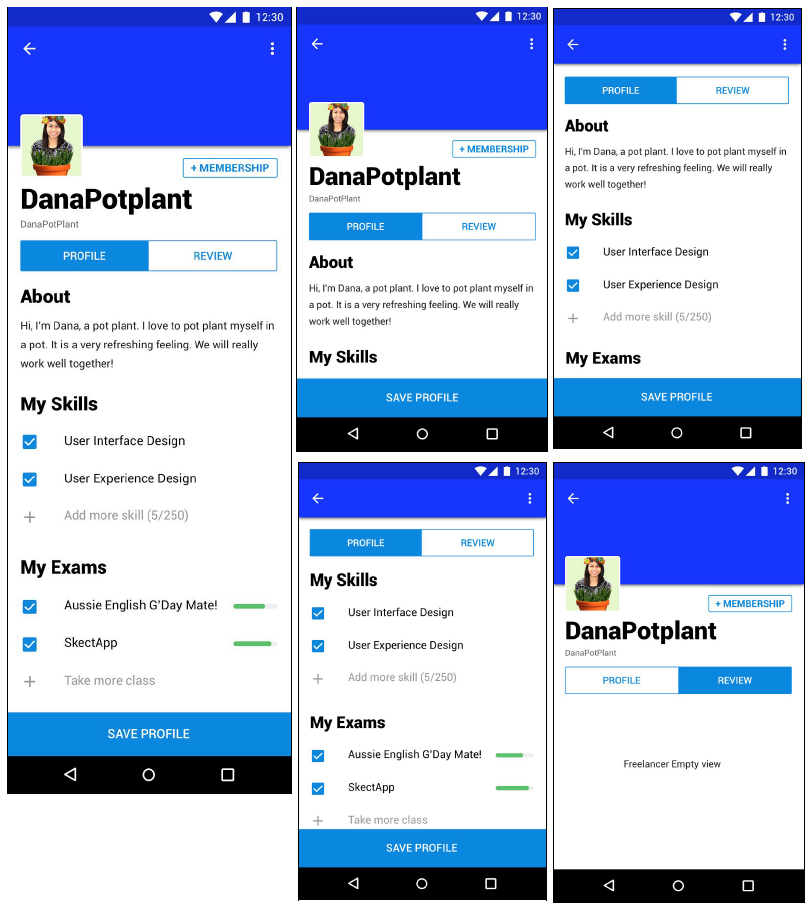

## Freelancer.com Android Developer Test

### UI Achieved
   

### Requirements

1. Given the API endpoint and the returned json blob below. Create a repository to fetch the
data with the repository pattern through RxJava, Dagger 2, and Retrofit library.

> Endpoint: www.freelancer.com/api/danapotplant

> Note: This is a dummy api endpoint and will not work. Please treat this is a future spec release
and implement with the dummy data.

```json
{
  "username": "DanaPotPlant",
  "files": null,
  "attachments": null,
  "bidperiod": 7,
  "skills": [
  	{
  	  "name": "User Interface Design"
    },
	{
  	  "name": "User Experience Design"
    }
  ],
  "exams": [
  	{
  	  "name": "Aussie English G’Day Mate!",
      "progress": 80
    },
	{
  	  "name": "SkectApp",
      "progress": 30
    }
  ],
  "avatar": "www.freelancer.com/img/danaplant.png"
}
```

2. Using the data from your previous answer. Create the view below with the MVP pattern
   and the use of CoordinatorLayout.
   
   
   
## Notes:
  1.  Profile and reviews are tabs so they can be slide and switched
  2.  CoordinatorLayout animation
    
    
  3. Default same blue color throughout

## Bonus
  * Bonus save profile button is sticky (as you scroll up and down, it is always visible)
  * Bonus menu option in the toolbar will have Share, Save, and Export option
